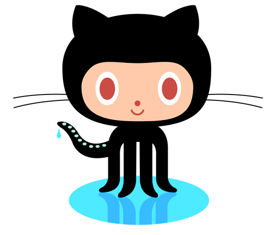

!SLIDE

# ¡Resque!

!SLIDE center

# GitHub's Background Processing Library

!SLIDE bullets incremental

# ¡Resque!

* Redis-backed
* parent / child fork model
* god / monit friendly
* Sinatra web UI

!SLIDE bullets incremental

# Why Redis?

* Atomic push and pop
* O(1) push and pop
* High visibility
* Modify existing queue in place

!SLIDE bullets incremental

# parent / child forking

* Parent starts & loads environment
* Parent grabs a job
* Parent forks
* Child processes job
* Child exits
* Repeat!

!SLIDE bullets incremental

# parent / child forking

* Child can die, parent lives on
* Parent is free to listen and respond to signals
* Parent can kill unruly children
* Parent can kill long running children

!SLIDE bullets incremental

# Signals

* `TERM`
* `QUIT`
* `USR1`

!SLIDE bullets incremental

# god / monit friendly

* Parent responds promptly to signals
* Can gracefully or forcefully shut down
* Advertises runtime in procline
* `resque: Forked 2739 at 1264118796`

!SLIDE center

# Sinatra web UI

